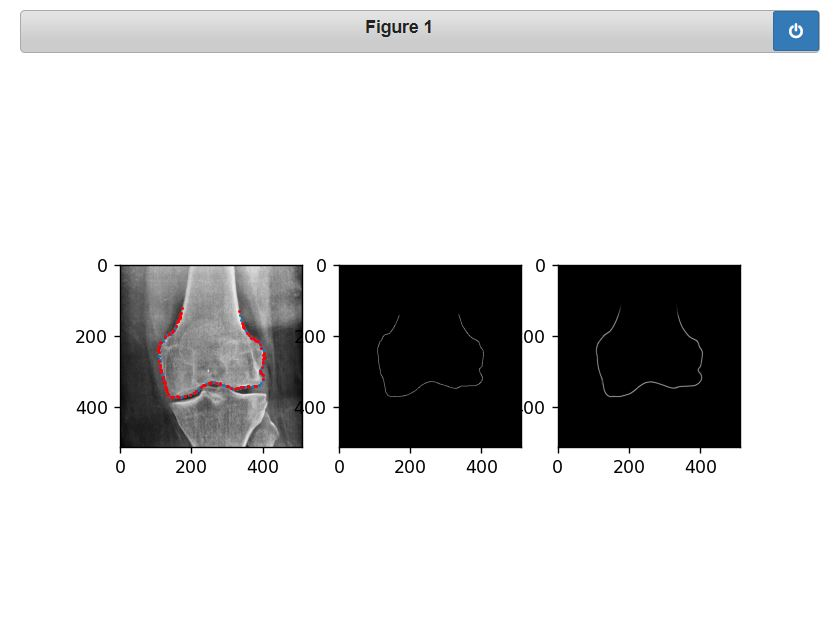
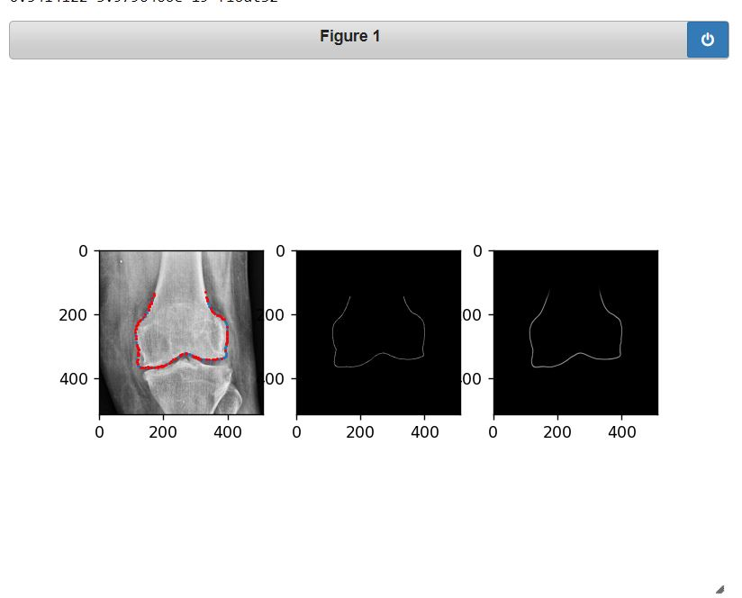
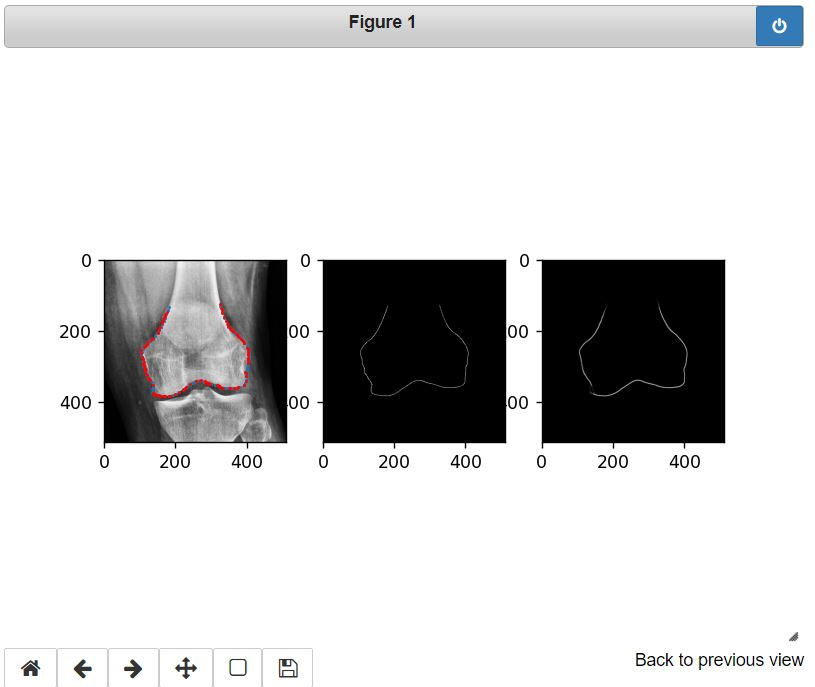
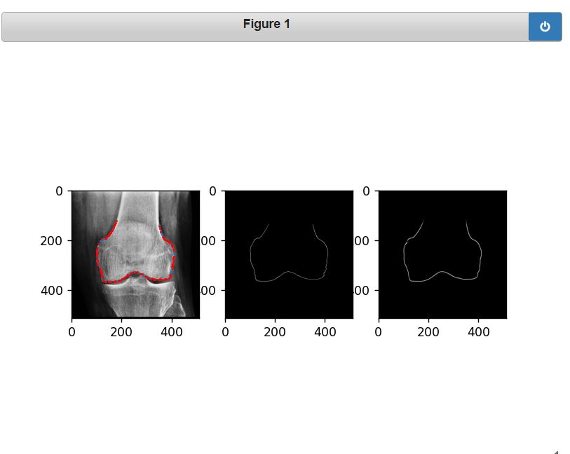
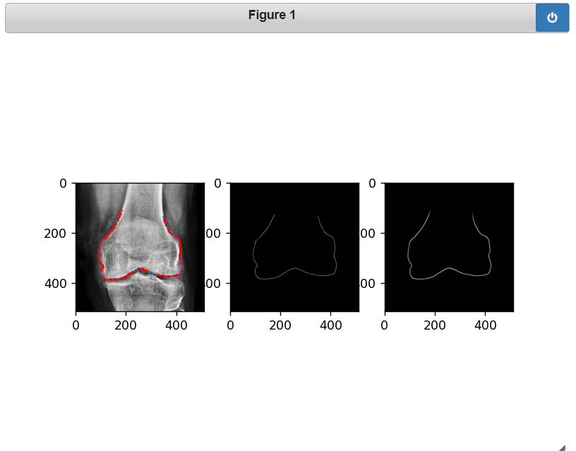
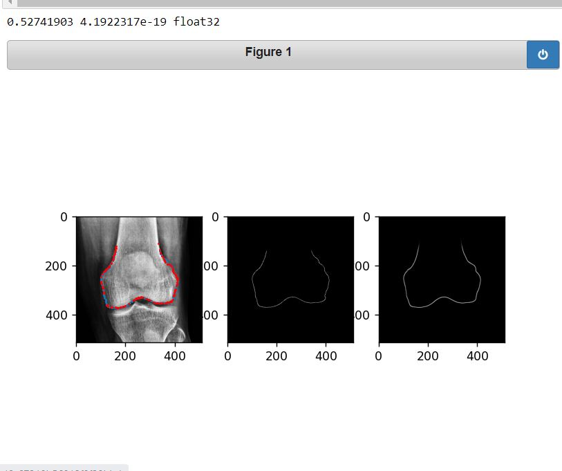

# Automatic-Knee-Contour-Detection-Using-U-net-Segmentation
This project uses U-Net to automate femur bone contour extraction in knee X-rays, aiding surgeons' decision-making. Manual annotation is time-consuming and repetitive, making deep learning a valuable solution. The model improves efficiency, accuracy, and consistency, reducing effort in surgical planning. This has been done using U-net based BioMedical Image Segmentation approach for Knee X-rays to automate contour extraction on femur bone

## References
[Heatmap Regression 2016](https://link.springer.com/chapter/10.1007/978-3-319-46723-8_27) 
[Heatmap Regression 2019](https://www.sciencedirect.com/science/article/pii/S1361841518305784) 
[Christian Payer et al. Github](https://github.com/christianpayer) 
[2D Dilated Residual U-net](https://arxiv.org/abs/1905.07710) 
[Stack U-net](https://arxiv.org/abs/1804.11294) 

## Output
### Legends
* Middle one is ground truth hand annotated 
* Right most is the predicted image
* Red points are predicted points extracted and downsampled from predicted image
* Blue Points are hand annotated points

#### 1.
 
#### 2.
 
#### 3.
 
#### 4.
 
#### 5.
 
#### 6.
 
